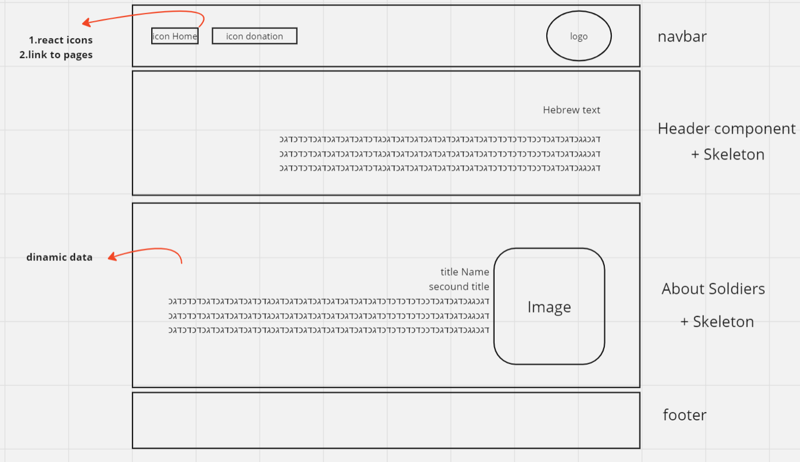

# commemoration

<p align="center">
An Commemorative application of soldiers
<br/>
<br/>
<a href="/">App</a>
</p>

<!-- ABOUT THE PROJECT -->

## 🌐 About The Project

### 🔥 Built With

List of frameworks/libraries used to bootstrap the project.

- Nodejs
- Nextjs
- Cascading Style Sheets & modules

<!-- GETTING STARTED -->

## 🚀 Getting Started

### 📃 Prerequisites

List of things you need to run the project locally and how to install them.

- fork the repo
- clone the repo

-npm

```sh
npm install
```
```sh
npm run dev
```

### 👩‍💻 Issues

- [#1](https://github.com/Haim-S/commemoration/issues/1) Arrange the navbar, according to the following description.
- [#2](https://github.com/Haim-S/commemoration/issues/2) To build preparation for a title and a tag for writing text in Hebrew.
- [#3](https://github.com/Haim-S/commemoration/issues/3) Build a skeleton for the header component.
- [#4](https://github.com/Haim-S/commemoration/issues/4) Build a dynamic card that will tell about each soldier in the AboutSoldiers component.
- [#5](https://github.com/Haim-S/commemoration/issues/5) Build a skeleton for the AboutSoldiers component.
- [#6](https://github.com/Haim-S/commemoration/issues/6) About the website builders in the footer component.

  
